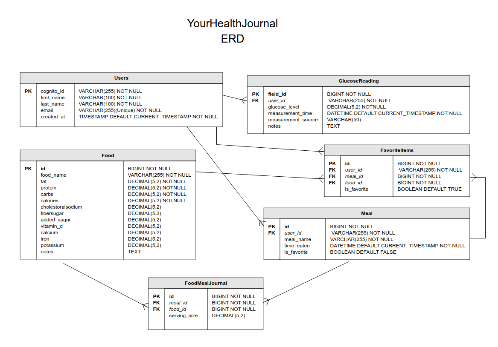

## Users Table

| Column Name  | Data Type                              | Required | Description                                |
|--------------|----------------------------------------|----------|--------------------------------------------|
| `cognito_id` | `VARCHAR(255)` (Primary Key)           | Yes      | Cognito `sub` claim, globally unique user ID |
| `first_name` | `VARCHAR(100)`                         | Yes      | User's first name                          |
| `last_name`  | `VARCHAR(100)`                         | Yes      | User's last name                           |
| `email`      | `VARCHAR(255)` (Unique)                | Yes      | Email address of the user (must be unique) |
| `created_at` | `TIMESTAMP DEFAULT CURRENT_TIMESTAMP`  | Yes      | Time when the user account was created     |

### Notes:
- `cognito_id` is used instead of a generated ID and comes directly from Cognito.
- `email` must still be unique.

---

## Food Table

| Column Name   | Data Type                              | Required | Description                          |
|---------------|----------------------------------------|----------|--------------------------------------|
| `id`          | `BIGINT` (Primary Key, Auto-Increment) | Yes      | Unique identifier for each food item |
| `food_name`   | `VARCHAR(255)`                         | Yes      | Name of the food item                |
| `fat`         | `DECIMAL(5,2)`                         | Yes      | Total fat in grams                   |
| `protein`     | `DECIMAL(5,2)`                         | Yes      | Total protein in grams               |
| `carbs`       | `DECIMAL(5,2)`                         | Yes      | Total carbohydrates in grams         |
| `calories`    | `DECIMAL(6,2)`                         | Yes      | Total calories                       |
| `cholesterol` | `DECIMAL(5,2)`                         | No       | Cholesterol in mg (optional)         |
| `sodium`      | `DECIMAL(5,2)`                         | No       | Sodium in mg (optional)              |
| `fiber`       | `DECIMAL(5,2)`                         | No       | Dietary fiber in grams (optional)    |
| `sugar`       | `DECIMAL(5,2)`                         | No       | Total sugar in grams (optional)      |
| `added_sugar` | `DECIMAL(5,2)`                         | No       | Added sugar in grams (optional)      |
| `vitamin_d`   | `DECIMAL(5,2)`                         | No       | Vitamin D in mcg (optional)          |
| `calcium`     | `DECIMAL(5,2)`                         | No       | Calcium in mg (optional)             |
| `iron`        | `DECIMAL(5,2)`                         | No       | Iron in mg (optional)                |
| `potassium`   | `DECIMAL(5,2)`                         | No       | Potassium in mg (optional)           |
| `notes`       | `TEXT`                                 | No       | Additional notes about the food      |

### Notes:
- Stores food nutritional details.
- Each food item is unique and can be used in multiple meals.

---

## Meal Table

| Column Name   | Data Type                              | Required | Description                                                             |
|---------------|----------------------------------------|----------|-------------------------------------------------------------------------|
| `id`          | `BIGINT` (Primary Key, Auto-Increment) | Yes      | Unique identifier for each meal                                         |
| `user_id`     | `VARCHAR(255)` (Foreign Key)           | Yes      | References the user who logged the meal (references `Users.cognito_id`) |
| `meal_name`   | `VARCHAR(255)`                         | Yes      | Name of the meal                                                        |
| `time_eaten`  | `DATETIME DEFAULT CURRENT_TIMESTAMP`   | Yes      | Timestamp of when the meal was eaten                                    |
| `is_favorite` | `BOOLEAN DEFAULT FALSE`                | No       | Marks if the meal is favorited                                          |

### Notes:
- The `user_id` column links the meal to a specific user.
- If a user is deleted, their meals are also deleted (`ON DELETE CASCADE`).

---

## FoodMealJournal Table

| Column Name    | Data Type                              | Required | Description                                                        |
|----------------|----------------------------------------|----------|--------------------------------------------------------------------|
| `id`           | `BIGINT` (Primary Key, Auto-Increment) | Yes      | Unique identifier for each record                                  |
| `meal_id`      | `BIGINT` (Foreign Key)                 | Yes      | References the meal that contains this food (references `Meal.id`) |
| `food_id`      | `BIGINT` (Foreign Key)                 | Yes      | References the food item (references `Food.id`)                    |
| `serving_size` | `DECIMAL(5,2)`                         | Yes      | The serving size of the food in this meal                          |

### Notes:
- Links `Food` and `Meal` in a many-to-many relationship.
- If a meal is deleted, its food entries are also removed (`ON DELETE CASCADE`).

---

## FavoriteItems Table

| Column Name   | Data Type                              | Required | Description                                                                |
|---------------|----------------------------------------|----------|----------------------------------------------------------------------------|
| `id`          | `BIGINT` (Primary Key, Auto-Increment) | Yes      | Unique identifier for the favorite record                                  |
| `user_id`     | `VARCHAR(255)` (Foreign Key)           | Yes      | References the user who favorited the item (references `Users.cognito_id`) |
| `meal_id`     | `BIGINT` (Foreign Key, Nullable)       | No       | References the meal if favoriting a meal (references `Meal.id`)            |
| `food_id`     | `BIGINT` (Foreign Key, Nullable)       | No       | References the food if favoriting a food (references `Food.id`)            |
| `is_favorite` | `BOOLEAN DEFAULT TRUE`                 | Yes      | Indicates if the item is favorited                                         |

### Notes:
- Users can favorite both meals and foods.
- If a **meal** is deleted, its favorite entry is also deleted (`ON DELETE CASCADE`).
- If a **food** is deleted, its favorite entry remains but `food_id` is set to `NULL` (`ON DELETE SET NULL`).

---

## GlucoseReading Table

| Column Name          | Data Type                              | Required | Description                                                                |
|----------------------|----------------------------------------|----------|----------------------------------------------------------------------------|
| `id`                 | `BIGINT` (Primary Key, Auto-Increment) | Yes      | Unique identifier for the glucose reading                                  |
| `user_id`            | `VARCHAR(255)` (Foreign Key)           | Yes      | References the user who logged the reading (references `Users.cognito_id`) |
| `glucose_level`      | `DECIMAL(5,2)`                         | Yes      | Blood glucose level in mg/dL                                               |
| `measurement_time`   | `DATETIME DEFAULT CURRENT_TIMESTAMP`   | Yes      | Timestamp of when the measurement was taken                                |
| `measurement_source` | `VARCHAR(50)`                          | Yes      | Source of measurement (`Manual`, `Dexcom`, `Nightscout`, etc.)             |
| `notes`              | `TEXT`                                 | No       | Optional notes for the reading                                             |

### Notes:
- Tracks blood glucose levels for each user.
- Supports manual and CGM readings (`measurement_source` is required).
- If a user is deleted, their glucose readings are also removed (`ON DELETE CASCADE`).
